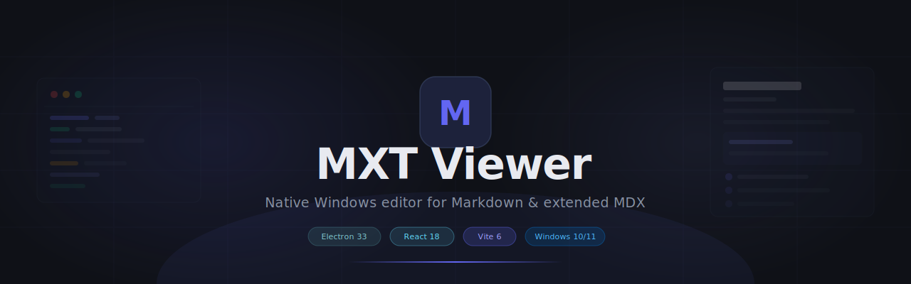
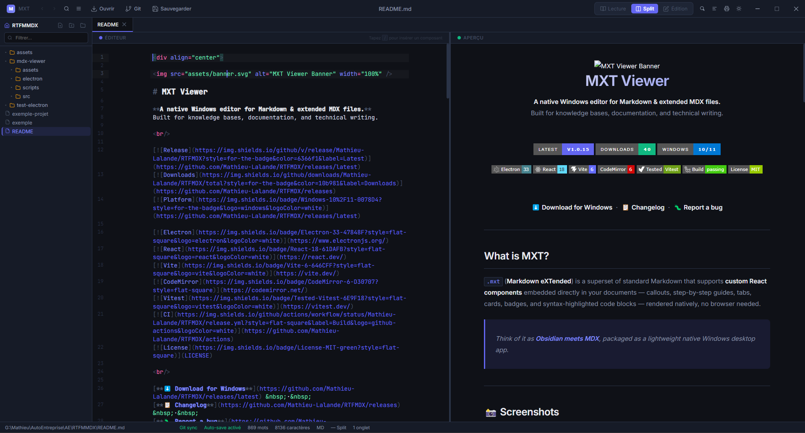
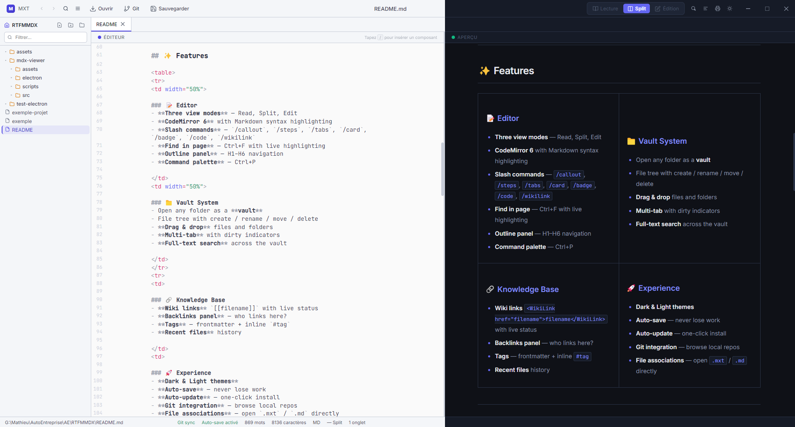
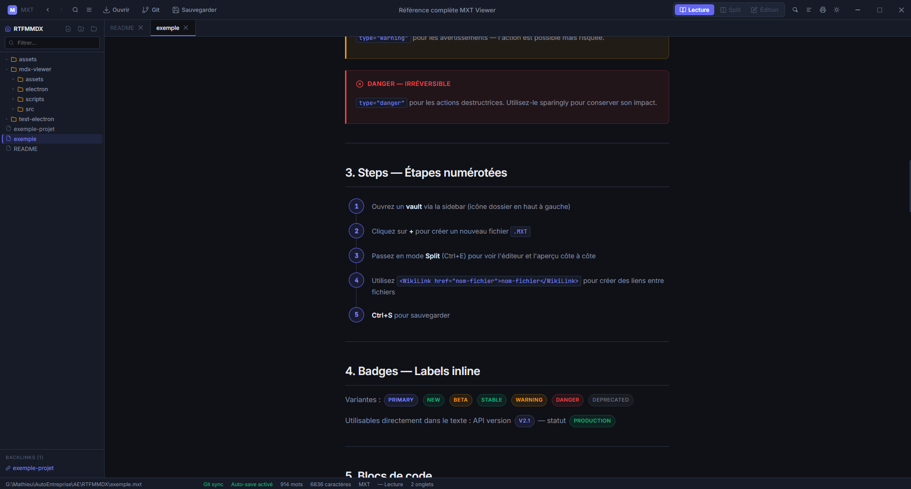

<div align="center">



# MXT Viewer

**A native Windows editor for Markdown & extended MDX files.**  
Built for knowledge bases, documentation, and technical writing.

<br/>

[](https://github.com/Mathieu-Lalande/RTFMDX/releases/latest)
[](https://github.com/Mathieu-Lalande/RTFMDX/releases)
[](https://github.com/Mathieu-Lalande/RTFMDX/releases/latest)

[](https://www.electronjs.org/)
[](https://react.dev/)
[](https://vite.dev/)
[](https://codemirror.net/)
[](https://vitest.dev/)
[](https://github.com/Mathieu-Lalande/RTFMDX/actions)
[](LICENSE)

<br/>

[**⬇️ Download for Windows**](https://github.com/Mathieu-Lalande/RTFMDX/releases/latest) &nbsp;·&nbsp;
[**📋 Changelog**](https://github.com/Mathieu-Lalande/RTFMDX/releases) &nbsp;·&nbsp;
[**🐛 Report a bug**](https://github.com/Mathieu-Lalande/RTFMDX/issues/new)

</div>

---

## What is MXT?

`.mxt` (**Markdown eXTended**) is a superset of standard Markdown that supports **custom React components** embedded directly in your documents — callouts, step-by-step guides, tabs, cards, badges, and syntax-highlighted code blocks — rendered natively, no browser needed.

> Think of it as **Obsidian meets MDX**, packaged as a lightweight native Windows desktop app.

---

## 📸 Screenshots

<div align="center">

### Split view — Edit & Preview side by side


### Dark & Light themes


### Custom components rendering


</div>

> 💡 **To add your screenshots**, drop images into the `assets/` folder at the repo root and push. File names should match the paths above.

---

## ✨ Features

<table>
<tbody>
<tr>
<td width="50%">

### 📝 Editor
- **Three view modes** — Read, Split, Edit
- **CodeMirror 6** with Markdown syntax highlighting
- **Slash commands** — `/callout`, `/steps`, `/tabs`, `/card`, `/badge`, `/code`, `/wikilink`
- **Find in page** — Ctrl+F with live highlighting
- **Outline panel** — H1–H6 navigation
- **Command palette** — Ctrl+P

</td>
<td width="50%">

### 📁 Vault System
- Open any folder as a **vault**
- File tree with create / rename / move / delete
- **Drag & drop** files and folders
- **Multi-tab** with dirty indicators
- **Full-text search** across the vault

</td>
</tr>
<tr>
<td>

### 🔗 Knowledge Base
- **Wiki links** `[[filename]]` with live status
- **Backlinks panel** — who links here?
- **Tags** — frontmatter + inline `#tag`
- **Recent files** history

</td>
<td>

### 🚀 Experience
- **Dark & Light themes**
- **Auto-save** — never lose work
- **Auto-update** — one-click install
- **Git integration** — browse local repos
- **File associations** — open `.mxt` / `.md` directly

</td>
</tr>
</tbody>
</table>

---

## 📦 Installation

> Requires **Windows 10 or 11**. No dependencies, no configuration.

**1.** Go to [**Releases**](https://github.com/Mathieu-Lalande/RTFMDX/releases/latest)  
**2.** Download `MXT Viewer-Setup-x.x.x.exe`  
**3.** Run the installer  
**4.** Open the app — or double-click any `.mxt` / `.md` file  

Updates are delivered automatically in the background.

---

## 🧩 Custom MXT Components

MXT adds 7 built-in components on top of standard Markdown:

<details>
<summary><strong>Callout</strong> — Colored alert boxes</summary>

```mdx
<Callout type="info" title="Good to know">
  Your message here. Types: info · warning · danger · success · tip
</Callout>
```
</details>

<details>
<summary><strong>Steps</strong> — Numbered step-by-step guides</summary>

```mdx
<Steps>
  <Step title="Install">Download the latest release.</Step>
  <Step title="Open a vault">Select your Markdown folder.</Step>
  <Step title="Write">Use / to insert components.</Step>
</Steps>
```
</details>

<details>
<summary><strong>Tabs</strong> — Interactive tab panels</summary>

```mdx
<Tabs>
  <Tab label="JavaScript">```js
console.log('hello')
```</Tab>
  <Tab label="Python">```python
print('hello')
```</Tab>
</Tabs>
```
</details>

<details>
<summary><strong>Cards</strong> — Responsive card grid</summary>

```mdx
<CardGrid>
  <Card title="Getting Started" href="[[guide]]">Quick intro.</Card>
  <Card title="Reference">Full docs.</Card>
</CardGrid>
```
</details>

<details>
<summary><strong>Badge</strong> — Inline status labels</summary>

```mdx
<Badge variant="new">New</Badge>
<Badge variant="beta">Beta</Badge>
<Badge variant="deprecated">Deprecated</Badge>
```
Variants: `default` · `primary` · `success` · `warning` · `danger` · `new` · `beta` · `deprecated`
</details>

<details>
<summary><strong>CodeBlock</strong> — Syntax highlighting with copy button</summary>

```mdx
<CodeBlock language="typescript" title="example.ts">
  const x: number = 42
</CodeBlock>
```
macOS-style chrome, language badge, one-click copy.
</details>

<details>
<summary><strong>WikiLink</strong> — Smart internal navigation</summary>

```mdx
<WikiLink href="other-doc">See also: Other Document</WikiLink>
```
Blue if the file exists · Orange if missing.
</details>

---

## ⌨️ Keyboard Shortcuts

| Shortcut | Action |
|---|---|
| `Ctrl+E` | Cycle modes: Read → Split → Edit |
| `Ctrl+S` | Save |
| `Ctrl+Shift+S` | Save As |
| `Ctrl+O` | Open file |
| `Ctrl+P` | Command Palette |
| `Ctrl+F` | Find in page |
| `Ctrl+D` | Duplicate file |
| `Alt+←` | Navigate back |
| `Alt+→` | Navigate forward |
| `N` | New file (sidebar focus) |

---

## 🗂️ Frontmatter

```yaml
---
title: My Document
date: 2026-04-06
author: Mathieu Lalande
tags: [documentation, guide, mxt]
readonly: false
---
```

Parsed and displayed as a metadata header in preview. `readonly: true` locks the file.

---

## 🛠️ Tech Stack

| Layer | Technology |
|---|---|
| Shell | [Electron 33](https://www.electronjs.org/) |
| UI | [React 18](https://react.dev/) + [Vite 6](https://vite.dev/) |
| Editor | [CodeMirror 6](https://codemirror.net/) |
| Renderer | [@mdx-js/mdx](https://mdxjs.com/) · remark-gfm · rehype-slug |
| Packaging | [electron-builder](https://www.electron.build/) NSIS |
| Auto-update | [electron-updater](https://www.electron.build/auto-update) |
| CI/CD | GitHub Actions |
| Tests | [Vitest](https://vitest.dev/) + [Testing Library](https://testing-library.com/) |

---

## 🏗️ Development

```bash
git clone https://github.com/Mathieu-Lalande/RTFMDX.git
cd RTFMDX/mdx-viewer
npm install
npm run dev       # dev mode with hot reload
npm run test:run  # run tests
npm run build     # build installer
```

**Requirements:** Node.js 20+, Windows

---

## 🚀 Releasing a new version

```bash
# Bump version in mdx-viewer/package.json, then:
git add -A
git commit -m "feat(version): vX.X.X"
git tag vX.X.X
git push origin main --tags
```

GitHub Actions builds the NSIS installer and publishes it. All running instances are notified automatically.

---

<div align="center">

Made with ☕ by [Mathieu Lalande](https://github.com/Mathieu-Lalande) · MIT License

</div>
